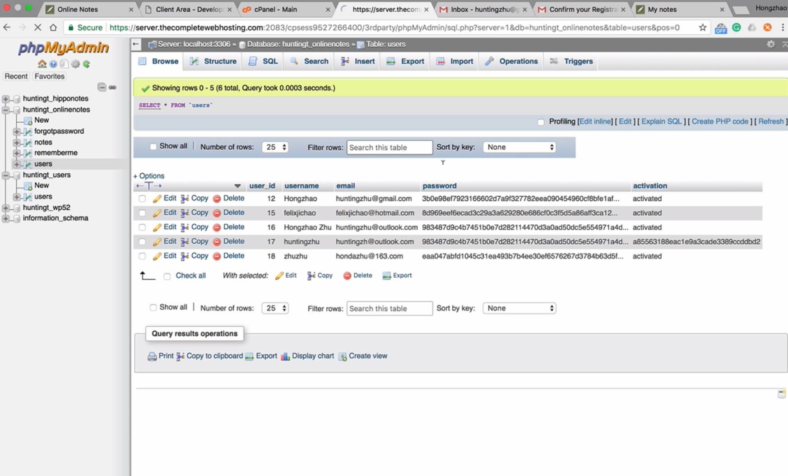

# Project Online notes App
This is an online notes app based on browser.

**Website**: http://hunting.thecompletewebhosting.com/noteapp

**Demo Video Link**: [https://www.youtube.com/watch?v=YDqRt6z8Fig](https://www.youtube.com/watch?v=YDqRt6z8Fig)

## Features:

1. Allow users to signup and login;
2. Allow users to store and edit their notes online;
3. Allow users to modify their profiles, like username, email and password;
4. The style of this app is mainly designed by using bootstrap and CSS;
5. The data of users are mainly stored in the MySQL database at the server whose URL is "http://hunting.thecompletewebhosting.com";
6. This app is coded with HTML, JavaScript and PHP.

## Demo Pictures:

## Contact
My email: huntingzhu@gmail.com
Welcome to contact me!
